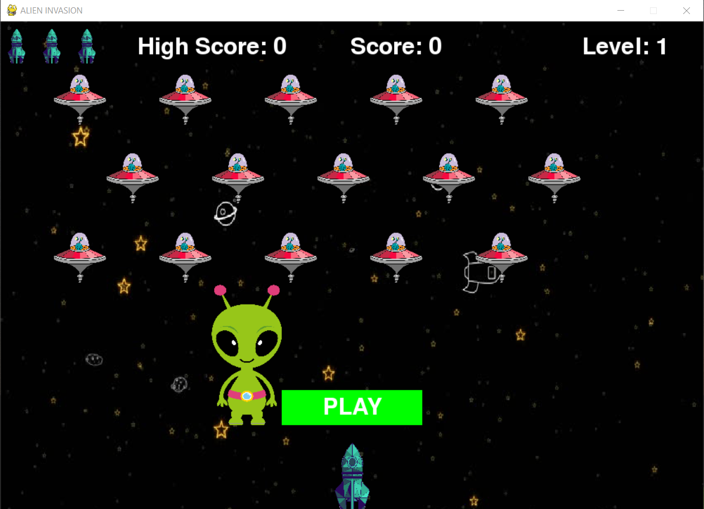

# 👽Beta Alien Attack
A simple game made using python3 and pygame...P.S. it's fun too...

<div align=center margin= auto> 
  
</div>

## 🚀 Introduction
> In Beta Alien Attack, the player controls a ship that appears at
the bottom center of the screen. The player can move the ship
right and left using the arrow keys and shoot bullets using the
spacebar. When the game begins, a fleet of aliens fills the sky
and moves across and down the screen. The player shoots and
destroys the aliens. If the player shoots all the aliens, the players 
enters the next level.In the subsequent levels,the new fleet
moves faster than the previous fleet. If any alien hits
the player’s ship or reaches the bottom of the screen, the player
loses a ship. If the player loses three ships, the game ends.

## 🔧 Requeriments
- [Python](https://www.python.org/) 3.x +
- [Pygame](https://www.pygame.org/)

## :video_game: Controls

- Space-bar
  - Shoot

- Arrows keys (left - right)
  - Move the ship left / right
  
 You can change the settings by some tweaks in settings class.

## ⚔ Let's play

### Cloning the Repository

```
$ git clone https://github.com/Priyanka-Sachan/beta-alien-attack.git

$ cd beta-alien-attack
```

### Running 

```
$ python alien_invasion.py
``` 

Enjoy!
